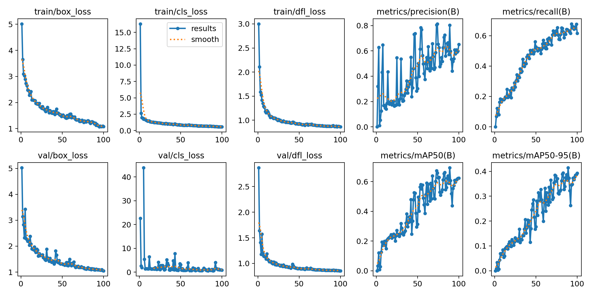
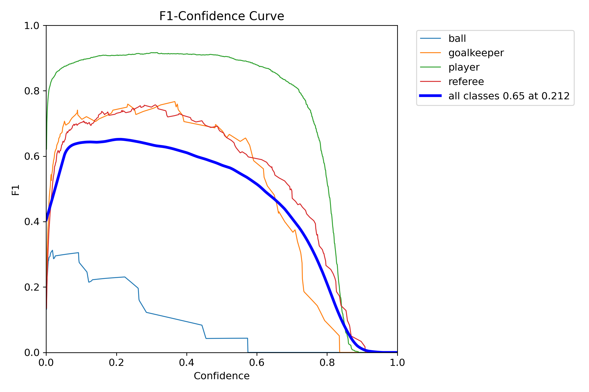
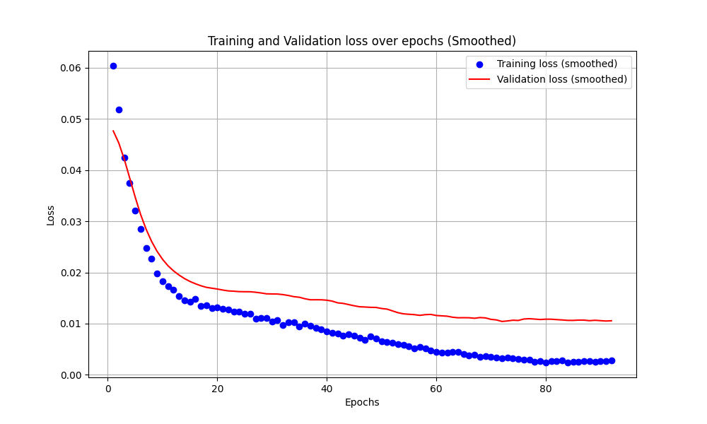
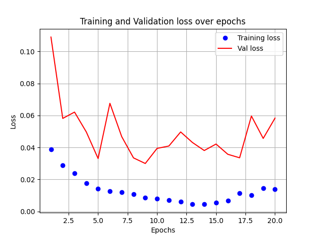
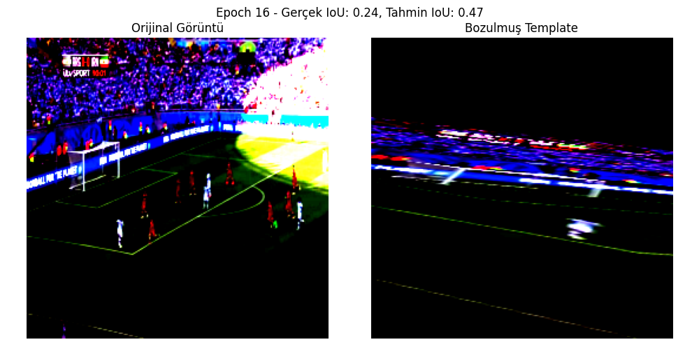
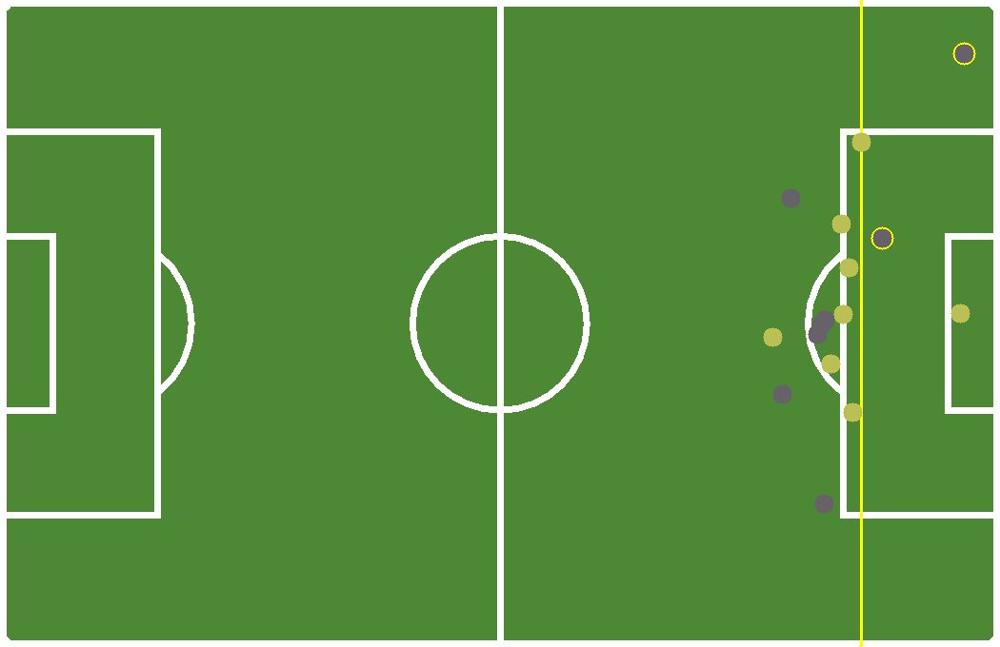
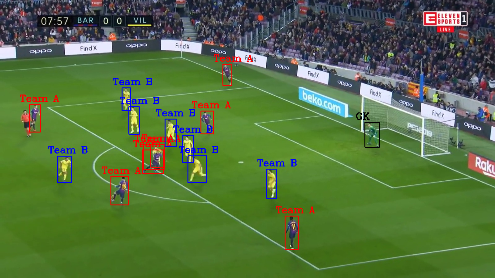
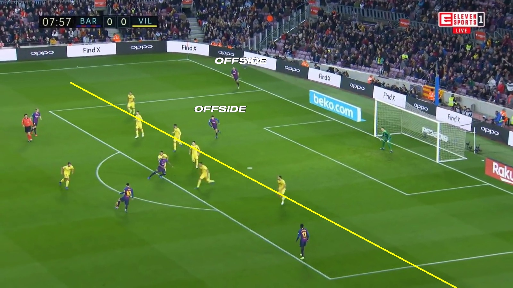

# Semi-Automated Offside Detection in Football

> [!IMPORTANT]
> **Download Models**
>
> This project requires trained model weights that are not included in the GitHub repository due to their size.
>
> 1.  **Download the models from Google Drive:**
>     [**CLICK HERE TO DOWNLOAD MODELS**](https://drive.google.com/drive/folders/16iUS24E1sh7_8WjPnMMOU7NVrRdjjKM7?usp=sharing)
>
> 2.  **Extract the contents and place them in the correct directories:**
>     *   Copy the `trained_init_guess` and `trained_loss_surface` folders into `model/sportsfield_release/out/`.
>     *   Copy the YOLOv8 weights (e.g., `best.pt`) into `model/teamClassification/weights/`.
>
>  final structure should look like this:
>
> ```
> Offside-Detection/
> └── model/
>     ├── sportsfield_release/
>     │   └── out/
>     │       ├── trained_init_guess/
>     │       └── trained_loss_surface/
>     └── teamClassification/
>         └── weights/
>             └── best.pt
> ```
>
> The application will not work without these .

\\

Automatically detect offside positions in football match frames using deep learning and computer vision. Reduces human error, supports referees with fast, objective analysis, and runs on a single camera feed.

---

## 📑 Table of Contents

* [About](#about)

* [Repo Structure](#repo-structure)

* [Installation](#installation)

* [Dependencies](#dependencies)

* [Usage](#usage)

  * [Graphical UI](#graphical-ui)
  * [Command-Line](#command-line)

* [Dataset & Training](#dataset--training)

* [Model Details](#model-details)

  * [Homography Estimation (Camera Registration)](#homography-estimation-camera-registration)
  * [Team Classification (KMeans)](#team-classification-kmeans)
  * [Offside Calculation](#offside-calculation)

* [Performance Metrics](#performance-metrics)

* [Results & Examples](#results--examples)

* [Comparison with FIFA System](#comparison-with-fifa-system)

* [Contributing](#contributing)

* [Contact](#contact)

---

## 📖 About

This project implements a **semi-automated offside detection** pipeline:

1. **Detect** players, referees, goalkeepers & the ball in a single frame (YOLOv8).
2. **Classify** each player into Team A or Team B by jersey color via KMeans.
3. **Register** the camera view to a top-down pitch template using learned homography models.
4. **Compute** attacker vs. defender positions & automatically draw the offside line.
5. **Visualize** results in 2D/3D and a user-friendly GUI.

Runs on Python 3.10+, requires only one video frame per decision, and can replace costly multi-camera systems.

---

## 📂 Repo Structure

offside--detection/
├── GUI/                            # Graphical interface assets
│   └── src/                        # UI code and resources
│       ├── elements/               # Custom widgets
│       ├── fonts/                  # Font files
│       ├── icons/                  # Icon images
│       ├── images/                 # GUI button & logo images
│       └── offside/                # Layout files

├──mainGUI.py                      # Launch GUI application
├── offside.py                      # Core offside detection pipeline (CLI)

├── model/                          # All model code & weights
│   ├── sportsfield_release/        # Homography models (WACV2020 adaptation)
│   │   ├── __pycache__/            # Python cache
│   │   ├── data/                   # Field mask and homography files
│   │   ├── datasets/               # Data loading and preprocessing scripts
│   │   │   └── aligned_dataset.py
│   │   ├── models/                 # Model definitions
│   │   │   ├── base_model.py
│   │   │   ├── init_guesser.py
│   │   │   ├── loss_surface.py
│   │   │   └── resnet.py
│   │   ├── options/                # Training options and configs
│   │   ├── out/                    # Pretrained model weights
│   │   │   ├── trained_init_guess
│   │   │   └── trained_loss_surface
│   │   ├── train/                  # Training scripts
│   │   │   ├── train_init_guesser.py  # Training script for Initial Guess model
│   │   │   └── train_loss_surface.py  # Training script for Loss Surface model
│   │   ├── utils/                  # Helper functions (warp, metrics, augmentations)
│   │   ├── world_cup_data_augmentation/  # Additional augmentation data
│   │   ├── calculateHomography.py  # Script to compute homography matrices
│   │   └── test_end2end.py         # End-to-end homography evaluation
│   └── teamClassification/         # Team classification by jersey color
│       ├── team_classification.py
│       └── weights/                # YOLO & KMeans trained weights
├── samples/                        # Example input frames
├── result/                         # Script outputs (2D/3D visualizations)
├── requirements.txt                # Python dependencies                       # License information
└── README.md                       # ← You are here here
```

offside--detection/
├── GUI/                            # Graphical interface assets
│   └── src/                        # UI code and resources
│       ├── elements/               # Custom widgets
│       ├── fonts/                  # Font files
│       ├── icons/                  # Icon images
│       ├── images/                 # GUI button & logo images
│       └── offside/                # Layout files
├── mainGUI.py                      # Launch GUI application
├── offside.py                      # Core offside detection pipeline (CLI)
├── model/                          # All model code & weights
│   ├── sportsfield_release/        # Homography models (WACV2020 adaptation)
│   │   ├── __pycache__/            # Python cache
│   │   ├── data/                   # Field mask and homography files
│   │   ├── datasets/               # Data loading and preprocessing scripts
│   │   │   └── aligned_dataset.py
│   │   ├── models/                 # Model definitions
│   │   │   ├── base_model.py
│   │   │   ├── init_guesser.py
│   │   │   ├── loss_surface.py
│   │   │   └── resnet.py
│   │   ├── options/                # Training options and configs
│   │   ├── out/                    # Pretrained model weights
│   │   │   ├── trained_init_guess
│   │   │   └── trained_loss_surface
│   │   ├── train/                  # Training scripts
│   │   │   ├── train_init_guesser.py  # Training script for Initial Guess model
│   │   │   └── train_loss_surface.py  # Training script for Loss Surface model
│   │   ├── utils/                  # Helper functions (warp, metrics, augmentations)
│   │   ├── world_cup_data_augmentation/  # Additional augmentation data
│   │   ├── calculateHomography.py  # Script to compute homography matrices
│   │   └── test_end2end.py         # End-to-end homography evaluation
│   └── teamClassification/         # Team classification by jersey color
│       ├── team_classification.py
│       └── weights/                # YOLO & KMeans trained weights
├── samples/                        # Example input frames
├── result/                         # Script outputs (2D/3D visualizations)
├── requirements.txt                # Python dependencies                      
└── README.md 
---

## ⚙️ Installation

1. **Clone the repo**

   ```bash
   git clone https://github.com/Dybali/offside--detection.git
   cd offside--detection
   ```
2. **Create & activate a virtual environment**

   ```bash
   python3 -m venv .venv
   source .venv/bin/activate      # Linux/macOS
   .venv\Scripts\activate       # Windows
   ```
3. **Install dependencies**

   ```bash
   pip install -r requirements.txt
   ```

---

## 🧩 Dependencies

> *Requires Python 3.10 or later*

```txt
# Homography
torch
numpy
tqdm
pillow
imageio

# Team Classification
ultralytics   # YOLOv8
scikit-learn  # KMeans
opencv-python

# GUI
tkinter
```

---

##  Usage

### 🔲 Graphical UI

```bash
python mainGUI.py
```

---

## 🏟 Dataset & Training

### Player & Ball Detection

* **Source:** Custom Roboflow dataset (372 labeled images)
* **Architecture:** YOLOv8x (trained from scratch, 100 epochs)
* **Augmentations:** Mosaic, HSV (hue 0.015, sat 0.7, val 0.4), rotation 0.1, translation 0.2, scaling 0.7, horizontal flip 0.5

The training process for the YOLOv8 model is summarized in the plots below, showing various loss and metric curves.



The F1-Confidence curve illustrates the model's performance across different confidence thresholds for each class.



### Homography Models

#### 1. Initial Guess Model

* **Purpose:** Provide a coarse but reliable initial estimation of the perspective transform (homography) mapping the broadcast frame to a bird's-eye pitch template.
* **Dataset:** 375 broadcast football images with paired field masks (`*_grass_gt.mat`) and ground-truth homography matrices (`*.homographyMatrix`). Split into 170 train / 35 val / 170 test.
* **Architecture:** ResNet-18 (BasicBlock × \[2,2,2,2]) from scratch, no ImageNet pretraining.
* **Input:** Single RGB frame resized to 256×256.
* **Output:** 8-dimensional vector of corner coordinates \[x1, y1, x2, y2, x3, y3, x4, y4].
* **Loss:** Smooth L1 loss between predicted and ground-truth corners.
* **Training:** 100 epochs, batch size 16, Adam optimizer (lr=1e-4).
* **Augmentations:** Random crop & resize, horizontal flip, brightness/contrast adjustment, small rotations (±10°), Gaussian noise.
* **Performance:** Median IoU on test set: 0.87; mean corner error: 5.2 pixels.

#### Training Progress (Initial Guess Model)

Below is the training and validation loss curve of the Initial Guess Model over epochs:



#### 2. Loss Surface (IoU Regressor) Model

* **Purpose:** Refine and evaluate candidate homographies by predicting the Intersection-over-Union (IoU) between warped pitch template and actual field lines.
* **Input:** Concatenated 6-channel tensor \[original frame (3 ch), warped template (3 ch)].
* **Architecture:** ResNet-18 (same as Initial Guess) with spectral normalization on all conv layers.
* **Output:** Single scalar value ∈ \[0,1] representing predicted IoU.
* **Loss:** Mean Squared Error (MSE) between predicted and true IoU.
* **Training:** 20 epochs, batch size 32, Adam optimizer (lr=5e-5).
* **Dataset & Augmentations:** Same splits as Initial Guess, homography candidates generated with ±15% random perturbations. Geometric and photometric augmentations applied.
* **Performance:** R² score: 0.92; MAE(IoU): 0.04.

#### Training Progress (Loss Surface Model)

The model was trained to predict the IoU between a warped template and the ground-truth field. Below is its training and validation loss curve:



This image shows a comparison between the original frame and the perturbed template, along with the predicted vs. actual IoU score.



These two models run sequentially: the Initial Guess provides a starting homography, then Loss Surface scores and selects the best adjustment, yielding a precise field registration.

### Team Classification

* **Method:** KMeans clustering on dominant jersey colors extracted by sampling each player's bounding box.
* **Clusters:** Automatically groups into two clusters (Team A vs. Team B).
* **Postprocessing:** Cluster centers swapped if necessary to match home/away color conventions.

---

##  Performance Metrics

| Class           | Precision | Recall | mAP\@0.5 | mAP\@0.5:0.95 |
| --------------- | --------- | ------ | -------- | ------------- |
| **Player**      | 0.894     | 0.924  | 0.966    | 0.665         |
| **Goalkeeper**  | 0.724     | 0.769  | 0.793    | 0.470         |
| **Referee**     | 0.761     | 0.709  | 0.780    | 0.452         |
| **Ball**        | 0.834     | 0.133  | 0.210    | 0.070         |
| **All classes** | 0.803     | 0.634  | 0.687    | 0.414         |

---

## 🎬 Results & Examples

### 2D Field Overlay




###classification




### 3D Pitch View


*(Adjust image paths/names as needed.)*

---

## Comparison with FIFA Offside System

| Feature          | FIFA System    | This Project           |
| ---------------- | -------------- | ---------------------- |
| Cameras Required | Multiple       | Single Frame           |
| Equipment Cost   | High           | 
---
## future plan
detection from videos 
adaptation to non-profesionaal leagues
## 🤝 Contributing

1. Fork the repo
2. Create a feature branch: `git checkout -b feature/YourFeature`
3. Commit your changes: `git commit -m "Add YourFeature"`
4. Push to branch: `git push origin feature/YourFeature`
5. Open a Pull Request


---

## Contact

**Ali Köçer**

* GitHub: [@Dybali](https://github.com/Dybali)

